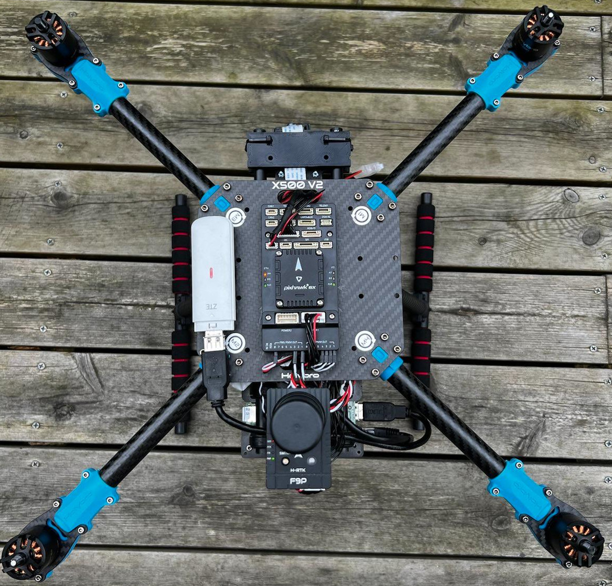
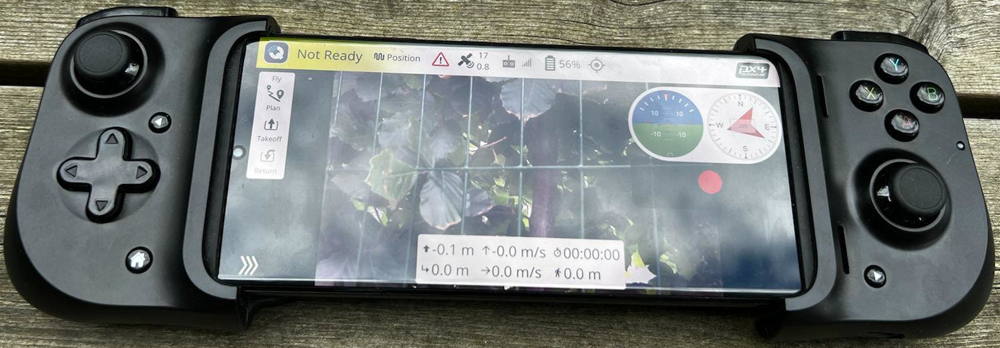

# RPiUAV
This repository aims at giving step by step instructs from zero to a fully operational UAV connected using a mobile phone and 4G/5G, by using available (ish) components and software. Some of the components selected are affected by the chip shortage (2022), and can be replaced as this hopefully improves going forward.

# High level
You build you own UAV using the recommended BOM here, and this repo provides you with software. The idea is to give you a cheap camera sensor in the sky that is not tied into any random eco system, but instead based on open source sortware and relatively cheap hardware (which hopefully also is available to buy). Should you deviate too much from the [recommended BOM](bom.md), you might have to either clone this repo and host everything yourself (which is not too hard to do), or convince the maintainer to include another deployment (which is OK if the setup is not too exotic).

The operator will connect to the UAV using his/hers phone, and the UAV will be connected using LTE. Any direct IP based radio/link can also be used, but a separate configuration will be needed.

The UAV should look something like this:

And the handcontroller like this:

[More pictures can be found here.](pictures.md)

## Dronecode ecosystem
The setup is built on the foundation of [Dronecode Foundation](https://www.dronecode.org/), which means that the following projects are used:
- [Pixhawk](https://pixhawk.org/) for autopilot hardware
- [PX4](https://px4.io/) for autopilo software (Ardupilot will work as well, but requires a slightly different configuration)
- [QGroundcontol](http://qgroundcontrol.com/) for handcontroller software

## Other major components
For onboard computer the setup is build around [Raspberry Pi 4 (Model B, min 4GB recommended)](https://www.raspberrypi.com/products/raspberry-pi-4-model-b/) and the [Raspberry Pi HQ Camera](https://www.raspberrypi.com/products/raspberry-pi-high-quality-camera/) ([or v2](https://www.raspberrypi.com/products/camera-module-v2/)). For communication we are using LTE and [Zerotier](https://www.zerotier.com/) for "VPN" like connectivity. [Zerotier is free for up to 25 nodes](https://www.zerotier.com/pricing/), and resonably priced above that.

## Companion computer
To connect all the pieces, we have a Raspberry Pi 4 (RPi) acting as a bridge between the onboard autopilot, and the controller and pilot on the ground. The RPi connects to the autopilot using either Ethernet or UART, and connects to the ground controller using LTE (4G) and Zerotier.

To make all work seamless, the Rpi runs a few apps to connect all the different pieces. Some runs natively (like Zerotier), while the rest are hosted as containers, on hosted inside a Kubernetes distribution called K3s.

The Apps hosted are:
- __Router:__ [The standard Mavlink Router](https://github.com/mavlink-router/mavlink-router) packaged inside a container. This sends the mavlink commands between the parties involved. Autopilot and ground controller being the most important ones.
- __Streamer:__ A GStreamer based video streamer, for sending video from the onboard camera
- __Announcer:__ Using Mavlink to announce the video stream. This way the video shows up automatically on the ground controller.
- __Companion:__ Small web interface to modify the most common configurations. Can also be used to restart the different apps. Either if they misbehave, or you need to restart after changing config.

## TODOs
- [x] Mavlink Router
- [x] Video Announcer
- [x] Servoes
- [x] k3s
- [x] Document BOM (Bill of Materials)
- [x] Document power-button
- [x] Document LED indicating running OS
- [x] Document 6X network settings
- [x] install.sh (only missing cgroup part)
- [x] Document autoupdate OS
- [x] Document install OS
- [x] Document zerotier
- [x] Step-by-step guide
- [x] Separate service for config
- [x] Set limit on cpu and memory for Apps (https://kubernetes.io/docs/tasks/configure-pod-container/assign-cpu-resource/)
- [ ] Publish documentation using Gitlab Pages: [https://about.gitlab.com/stages-devops-lifecycle/pages/](https://about.gitlab.com/stages-devops-lifecycle/pages/)
- [ ] Document use of pan/tilt servoes
- [ ] Document 3D model for pant/tilt setup
- [ ] Document hardware installation
- [ ] Document high level concept
- [ ] Consider k3s hardening ([https://rancher.com/docs/k3s/latest/en/security/hardening_guide/](https://rancher.com/docs/k3s/latest/en/security/hardening_guide/))
- [ ] Try to avoid network=host for Router (see Nodeport range below)
- [ ] Try to avoid network=host for Streamer (see Nodeport range below)
- [ ] Try to avoid "priviledged=true" for Streamer (must grant access to camera)
- [ ] Try to avoid "priviledged=true" for Router (must grant access to serial port)
- [ ] (Nice to have) Consider moving Announcer to Companion
- [ ] (Nice to have) Improve Companion by connecting to Mavlink
- [ ] (Nice to have) Show Autopilot Status on Companion
- [ ] (Nice to have) Show Autopilot position on Companion
- [ ] (Nice to have) Set important paramaters on Autopilot using Companion over Mavlink
- ~~[ ] Enable Origin check for Companion~~ (not needed for now. Will only complicate setups)
- ~~[ ] Smaller image for STREAMER, if possible~~ (GStreamer+Python will increase size)

### [ ] TODO: Extend range for allowed port for NodePort
Default NodePort will only allow ports between 30000 and 32767. This could work, but will cause some non-standard port to be used for services, and might cause problems down stream.

Fix is to extend allowed port range for NodePort, and this will be done during installation of k3s. Must add the following 
    --service-node-port-range “1000-32767”

Or use config file for installation: [https://rancher.com/docs/k3s/latest/en/installation/install-options/#configuration-file](https://rancher.com/docs/k3s/latest/en/installation/install-options/#configuration-file)

## Install software
### Step 1 - Install OS
Follow [these insstruction](os.md)

### Step 2 - base software
    curl -s https://gitlab.com/got.vision/rpiuav/-/raw/main/install/install_base.sh | sh -

### Step 3 - reboot
    sudo reboot

### Step 4 - specific software
    curl -s https://gitlab.com/got.vision/rpiuav/-/raw/main/install/install_rpiuav.sh | sh -

### Step 5 - join Zerotier network
Follow [instructions here](zerotier.md)
    

## Details
- [Gimbal](gimbal/README.md)

## Shutdown button
Connect [GND](https://pinout.xyz/pinout/ground#) and [GPIO 3](https://pinout.xyz/pinout/pin5_gpio3#) between a button. Final step is to add `dtoverlay=gpio-shutdown,gpio_pin=3` to the end of the file `/boot/config.txt` (install.sh will do this for you). A quick reboot later, and you can shut doen the OS by clicking the button. Mark that the RPi will not power down, and hence, still consume a bit of power. But the OS will be cleanly shut down, to prevent currupted files. This in combination with a status LED will make sure your RPi will operate for a long time.

## Staus LED
Connect the short leg of the LED to an resistor of about 480OHM, and the other side of the resistor to [GND](https://pinout.xyz/pinout/ground#). The long leg of the LED you connect to [GPIO 17](https://pinout.xyz/pinout/pin11_gpio17#). Also add `dtoverlay=gpio-led,gpio=17,trigger=default-on,label=statusled0` to the end of the file `/boot/config.txt` (install.sh will do this for you). Reboot, and you will have en external LED, that can be much easier for the operator to see than the fixed on RPi.
