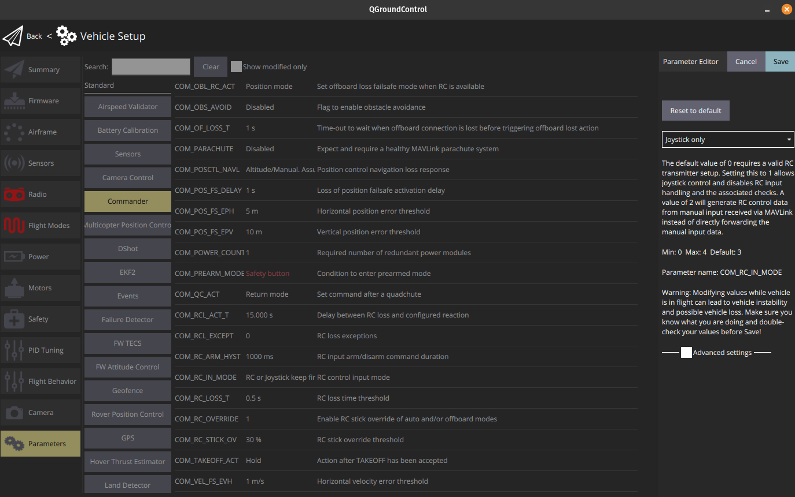
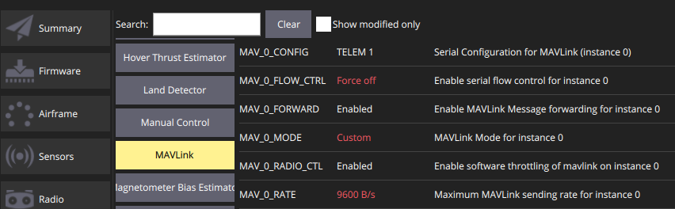
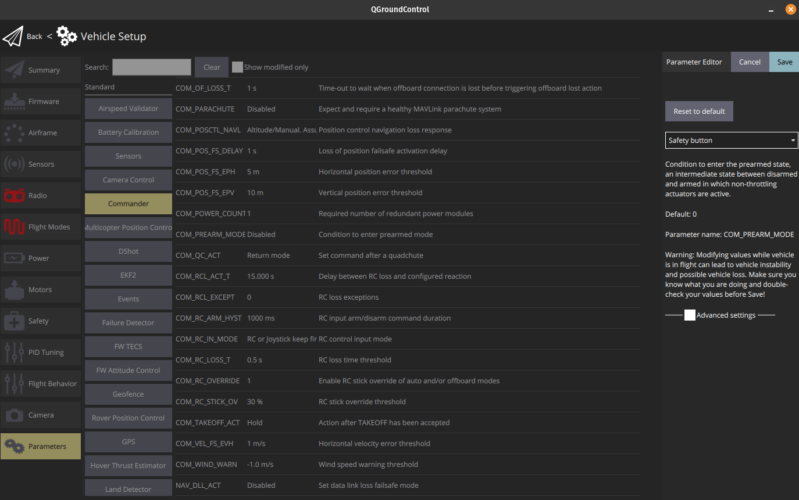
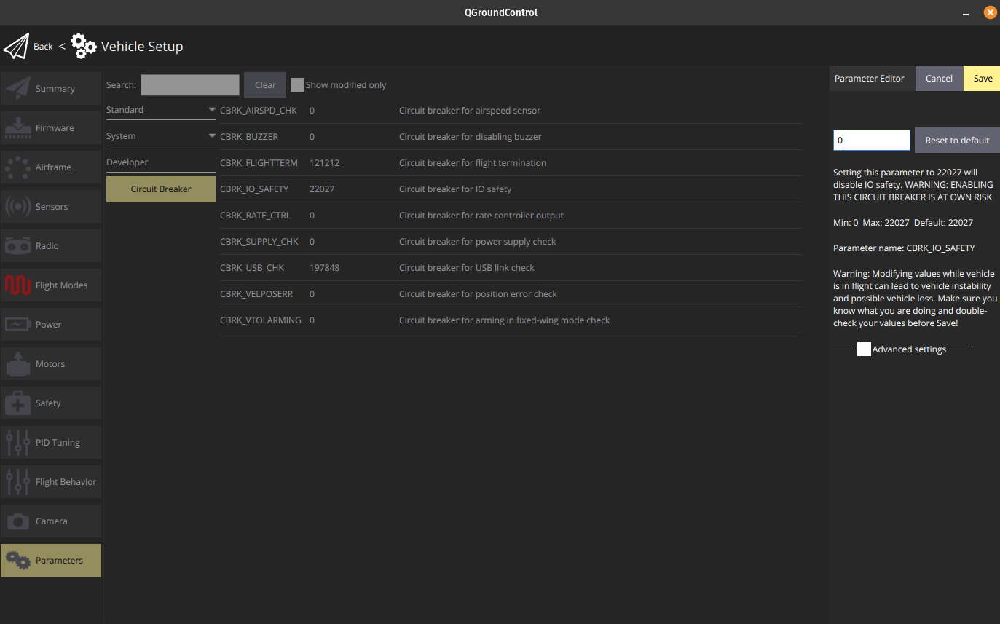
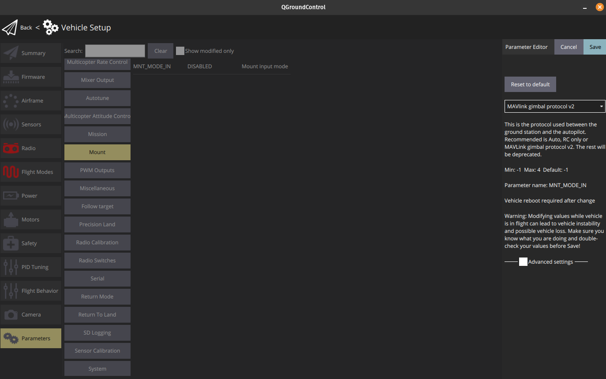

# Autopilot

## Firmware
Connect using USB cable and upgrade firmware to newest version.

## Frametype
Select frametype as show in this image:

## TELEM1 Baud rate
Set the baud rate for TELEM1 as shown in this image:

## Only use joystick
Set joystick only:

## Mavlink
Set Mavlink to look like this:

## Mic
Set the following as well:

