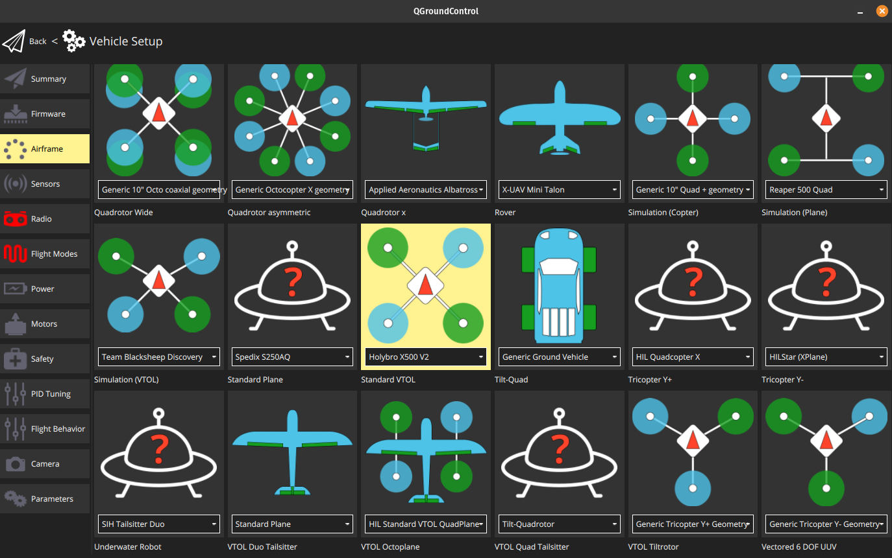
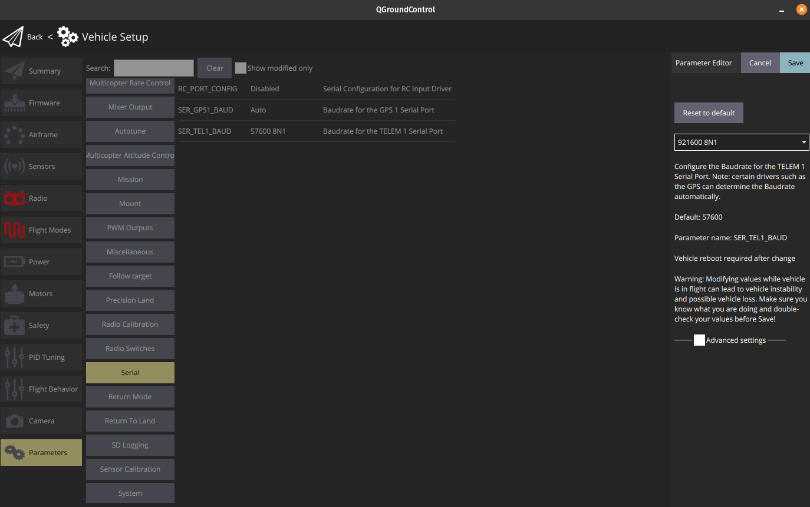

# Autopilot

## Firmware
Connect using USB cable and upgrade firmware to newest version.

## Frametype
Select frametype as show in this image:

## TELEM1 Baud rate
Set the baud rate for TELEM1 as shown in this image:

