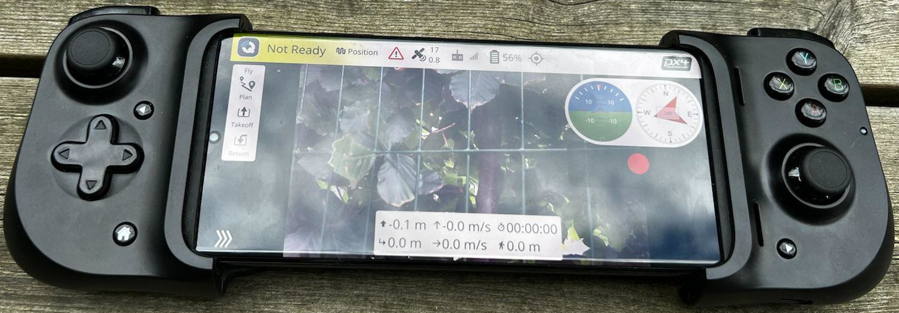

# :helicopter: RPiUAV

## :dart: Goal

[Pixhawk](https://pixhawk.org/) and [Dronecode](https://www.dronecode.org/) are very powerful and mature platforms and eco-systems, but they lack the final wrapping to make a complete UAV system. This repository aims at providing this final wrapping, and making it as easy as possible to get started with a fully operational camera drone using LTE for communications.

## :book: TL;DR

This repository aims at giving instructs from zero to a fully operational UAV connected using a mobile phone and 4G/5G, by using available (ish) components and software. Some of the components selected are affected by the chip shortage (2022), and might be replaced as this hopefully improves shortly. This repository should make it easy to get up and running with a complete camera drone, and to keep it up to date at all time.

## :rocket: Motivation

Main motivations for this repo:

- Bring all the pieces together to make a complete system.
- Make it as easy as possible to get started.
- Make it easy to keep the system up to date.

## :rotating_light: Disclaimer

Check the regulations in the country you are flying in, and make sure you are allowed to fly the UAV. LTE allows you to easily fly Beyond Visual Line of Sight (BVLOS), but you still need to follow the rules for BVLOS (which in most contries requires a special permit).

## :warning: What this repo is not

This repo is not a [Lego](https://www.lego.com) or [Ikea](https://www.ikea.com/) style documentation, holding your hand every step of the way. This is a noble goal to have, to get the documentation up to that level. This might happen one day, but I am sorry to report that today is not that day. :sweat_smile:

## :compass: High level

You build you own UAV using the recommended BOM here, and this repo provides you with software. The idea is to give you a cheap camera sensor in the sky that is not tied into any random eco system, but instead based on open source sortware and relatively cheap hardware (which hopefully also is available to buy). Should you deviate too much from the [recommended BOM](bom.md), you might have to either clone this repo and host everything yourself (which is not too hard to do), or convince the maintainer to include another deployment (which is OK if the setup is not too exotic).

The operator will connect to the UAV using his/hers phone, and the UAV will be connected using LTE. Any direct IP based radio/link can also be used, but a separate configuration will be needed.

The UAV should look something like this:

And the handcontroller like this:

[More pictures can be found here.](pictures.md)

The different components on the drone are [connected like this](physical.md).

Which including the software [logically looks like this](logical.md).

## :busts_in_silhouette: Dronecode ecosystem

The setup is built on the foundation of [Dronecode Foundation](https://www.dronecode.org/), which means that the following projects are used:

- [Pixhawk](https://pixhawk.org/) for autopilot hardware
- [PX4](https://px4.io/) for autopilo software (Ardupilot will work as well, but requires a slightly different configuration)
- [QGroundcontol](http://qgroundcontrol.com/) for handcontroller software

## :gear: Other major components

For onboard computer the setup is build around [Raspberry Pi Compute Module 4](https://www.raspberrypi.com/products/compute-module-4) and the [Raspberry Pi HQ Camera](https://www.raspberrypi.com/products/raspberry-pi-high-quality-camera/) ([or v2](https://www.raspberrypi.com/products/camera-module-v2/)). For communication we are using LTE and [Zerotier](https://www.zerotier.com/) for "VPN" like connectivity. [Zerotier is free for up to 25 nodes](https://www.zerotier.com/pricing/), and resonably priced above that.

## :computer: Companion computer

To connect all the pieces, we have a [Raspberry Pi Compute Module 4](https://www.raspberrypi.com/products/compute-module-4) (RPi) acting as a bridge between the onboard autopilot, and the controller and pilot on the ground. The RPi connects to the autopilot using either Ethernet or UART, and connects to the ground controller using LTE (4G) and Zerotier.

To make all work seamless, the Rpi runs a few apps to connect all the different pieces. Some runs natively (like Zerotier), while the rest are hosted as containers, and hosted inside a Kubernetes distribution called K3s.

The Apps hosted are:

- __Router:__ [The standard Mavlink Router](https://github.com/mavlink-router/mavlink-router) packaged inside a container. This sends the mavlink commands between the parties involved. Autopilot and ground controller being the most important ones.
- __Streamer:__ An RTSP video streamer called [rtsp-simple-server](https://github.com/aler9/rtsp-simple-server).
- __Announcer:__ Using Mavlink to announce the video stream. This way the video shows up automatically on the ground controller.
- __Companion:__ Small web interface to modify the most common configurations. Can also be used to restart the different apps. Either if they misbehave, or you need to restart after changing config.
