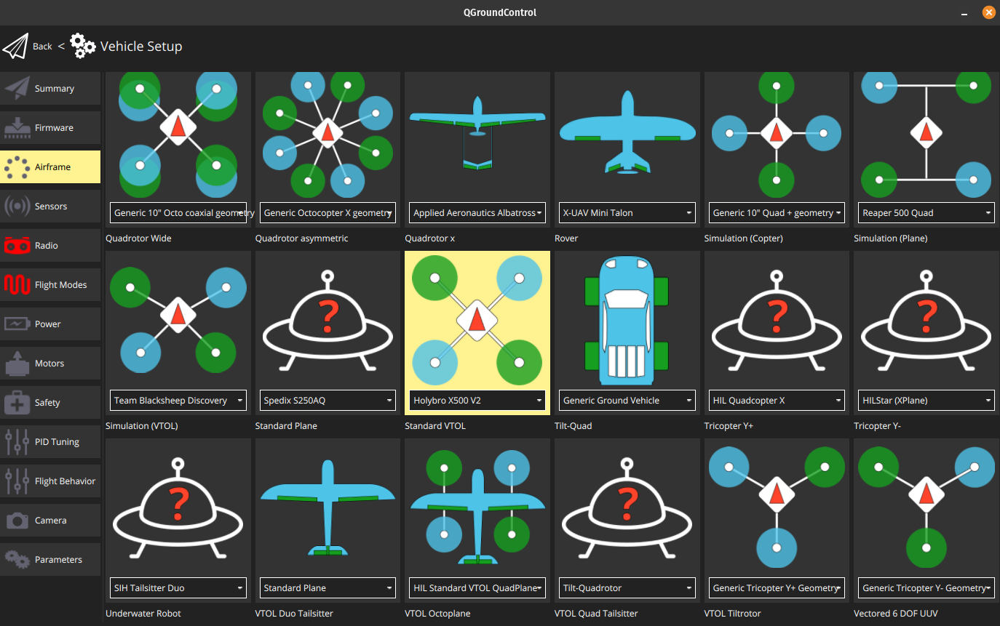
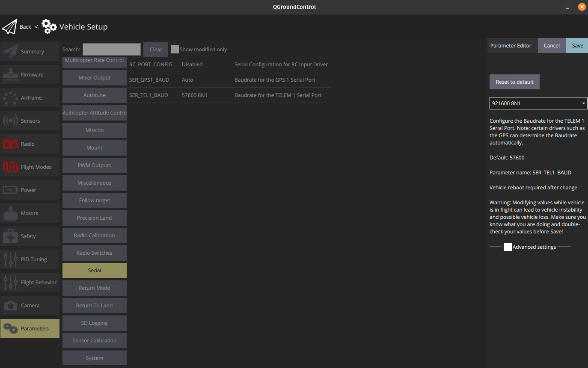
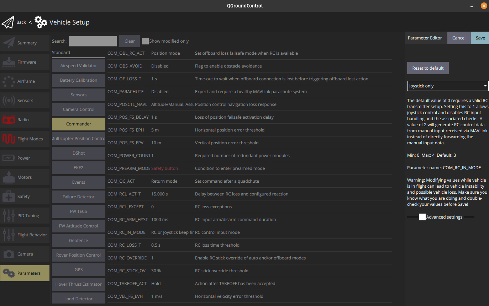
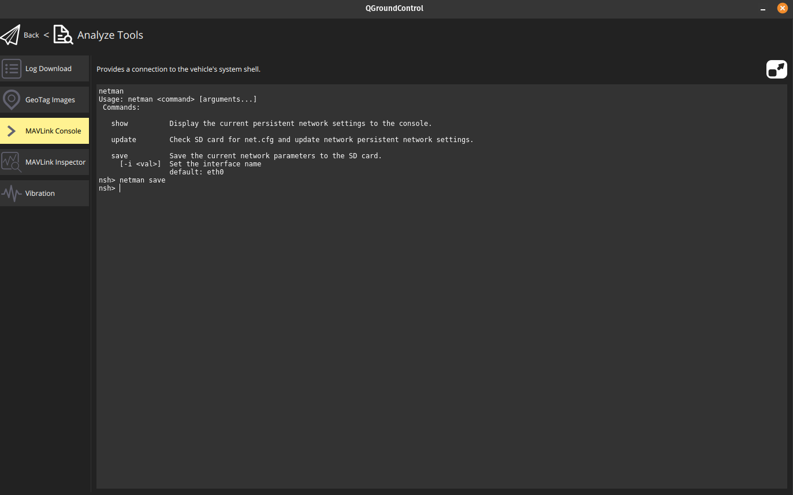
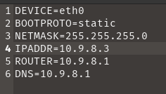
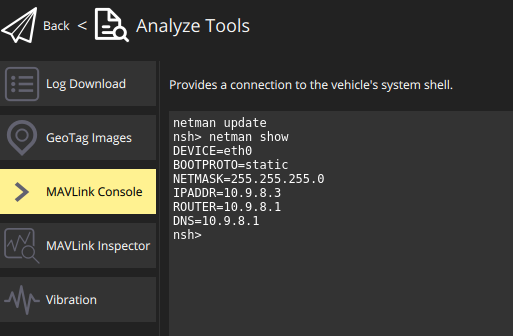
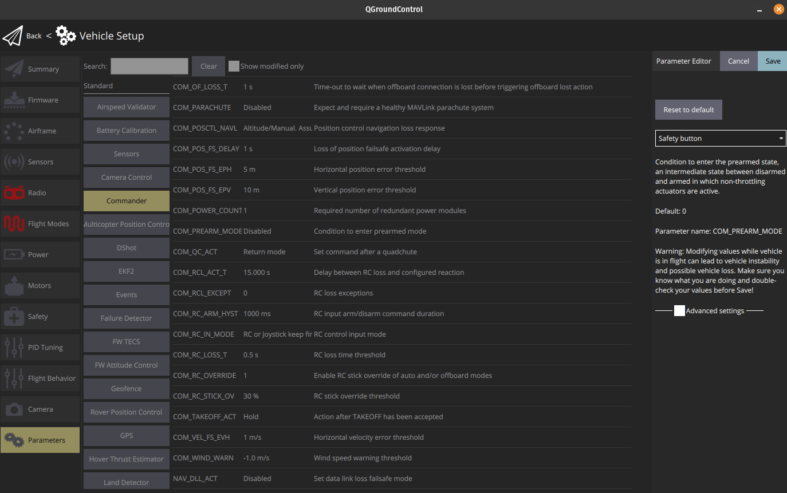
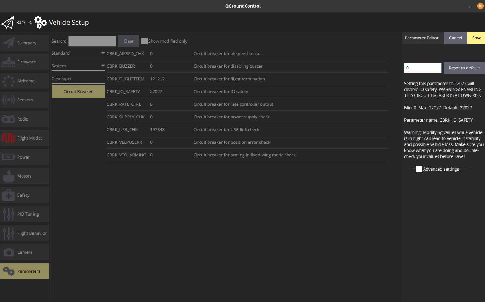
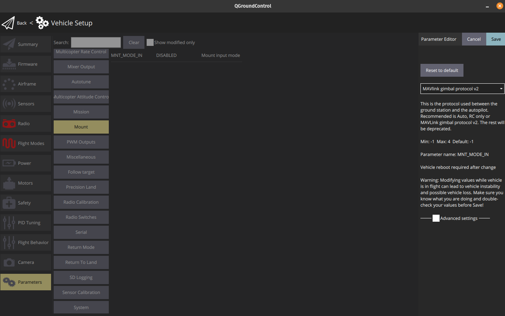

# Autopilot
The recommended autopilot is a Pixhawk 6X, as it is currently the newest version out, and it has ethernet. Pretty much all hardware compatible with the pixhawk standards will do, but then you need to deviate from this guide on a few places.

Documentation for Pixhawk 6X can be found here: [https://docs.holybro.com/autopilot/pixhawk-6x](https://docs.holybro.com/autopilot/pixhawk-6x)

## Firmware
Connect using USB cable and upgrade firmware to newest version.

## Frametype
Select frametype as show in this image:

## TELEM1 Baud rate
Set the baud rate for TELEM1 as shown in this image:

## Only use joystick
Set joystick only:

## Mavlink
MAVLink will connect using Ethernet to the RPi. The following settings should be verified:
- MAV_2_BROADCAST: Always broadcast
- MAV_2_CONFIG: Ethernet
- MAV_2_FLOW_CTRL: Auto-detect
- MAV_2_FORWARD: Enable
- MAV_2_MODE: Normal
- MAV_2_RADIO_CTRL: Disable
- MAV_2_RATE: 1000000 B/s
- MAV_2_REMOTE_PRT: 14555 #IMPORTANT!!!!
- MAV_2_UDP_PRT: 14550

Set Mavlink to look like this (you can ignore MAV_0 and MAV_1 settings):

## Network (for 5X and 6X versions)
To set IP adress for the autopilot, some manual work needs to be done:
- 1. export a config file to the SD card on the autopilot
- 2. eject the SD card from the autopilot and insert into a computer
- 3. modify the values to be in same subnet as RPi
- 4. move SD card back to autopilot (remember to save and eject from PC)
- 5. Read new config into autopilot
- 6. Reboot

### Step 1: export a config file to the SD card on the autopilot
Connect the autopilot using an USB cable, and start MAVLink console inside QGroundcontrol, and type `netman save`. That is all for this step.

### Step 2: eject the SD card from the autopilot and insert into a computer
Power down the autopilot, and locate the SD card on the side of the top box. Eject and insert onto computer able to edit a text file.

### Step 3: modify the values to be in same subnet as RPi
Open the file called `net.cfg`, and make sure the content is chenged to the following:
- DEVICE=eth0
- BOOTPROTO=static
- NETMASK=255.255.255.0
- IPADDR=10.9.8.3
- ROUTER=10.9.8.1
- DNS=10.9.8.1

Looking like this:

### Step 4: move SD card back to autopilot
Save the content of the file, and make sure to eject the SD card from the PC. If not, you changes might not have been written to the SD card. Insert the SD card back in to the autopilot.

### Step 5: Read new config into autopilot
Go back to MAVLink Console and type: `netman update`. This will read the content of the file you modified and apply them to the autopilot. To verify that the config was accepted, you can type `netman show`. The result should look like this:

## Misc
Set the following as well:

