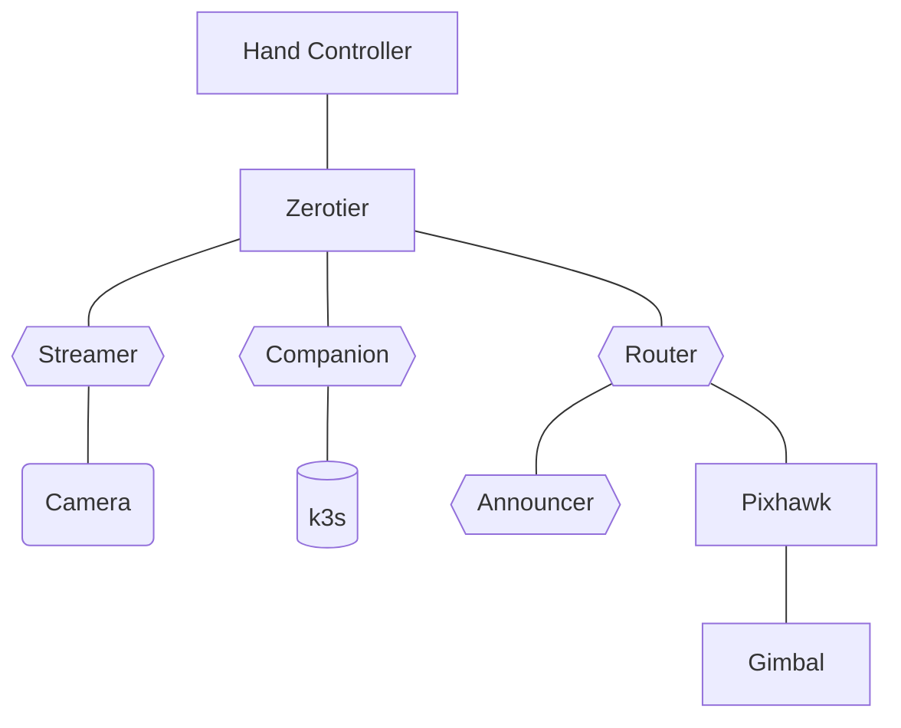

# Logically

Logically the system looks like this:

```mermaid
flowchart TD
    PIX --- GIM[Gimbal]
    STREAM{{Streamer}} --- CAM(Camera)
    COMP{{Companion}} --- k3s[(k3s)]
    ROUTER{{Router}} --- ANNO{{Announcer}}
    ROUTER --- PIX[Pixhawk]
    ZT[Zerotier] --- STREAM
    ZT --- COMP
    ZT --- ROUTER
    GCS[Hand Controller] --- ZT 
```
