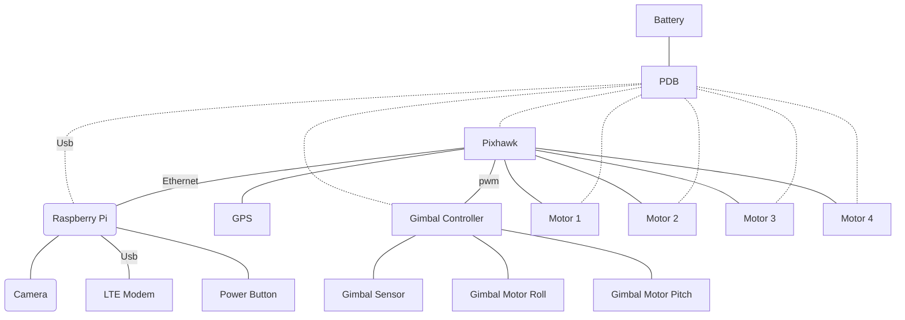

# Physical

The different components are connected like this:

```mermaid
flowchart TD
    PIX[Pixhawk] ---|Ethernet| RPI(Raspberry Pi)
    RPI --- C(Camera)
    PIX --- GPS[GPS]
    PIX --- |pwm| D[Gimbal Controller]
    D --- E[Gimbal Sensor]
    D --- F[Gimbal Motor Roll]
    D --- G[Gimbal Motor Pitch]
    H[Battery] --- PDB[PDB]
    PDB -.- |Usb| RPI
    PDB -.- PIX
    PDB -.- D
    PDB -.- M1[Motor 1]
    PDB -.- M2[Motor 2]
    PDB -.- M3[Motor 3]
    PDB -.- M4[Motor 4]    
    RPI --- |Usb| LTE[LTE Modem]
    RPI --- POW[Power Button]
    PIX --- M1
    PIX --- M2
    PIX --- M3
    PIX --- M4
```