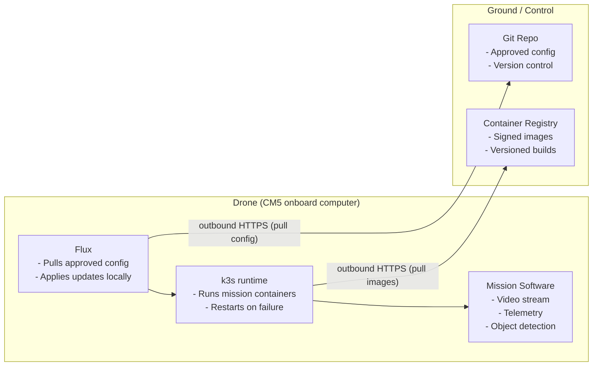

# Upgrade strategy

## What we’re doing

We install a lightweight Kubernetes distribution called k3s on the onboard computer (Raspberry Pi CM5) inside the drone.
That k3s instance acts as the runtime for all mission software in containers (video pipeline, telemetry, AI/object detection, etc.).

We then install Flux, which keeps that runtime in sync with a central Git repository that we control.

The drone pulls updates from us. We never have to “log in” to the drone from the outside.

The software installed on the drone remains very lightweight, and simple to maintain.

## How software runs on the drone

Inside the drone, k3s is responsible for:

- Starting the required containers when the drone boots
- Restarting them automatically if they crash
- Making sure all the software that’s supposed to be running is actually running

Think of k3s as the local supervisor: it enforces “this is the software stack for this drone.”

Typical workloads on the node can include:

- Video capture and streaming
- Telemetry formatting and forwarding
- Onboard analytics / object detection
- Mission- or safety-related logic that needs to run even with no network

All of these run side by side, isolated from each other, and can be updated independently.

This gives us modularity: we don’t ship “a new drone image,” we ship “a new vision component,” or “a new telemetry encoder,” etc.

## How the drone gets updates (Flux / GitOps model)

We do not push software into the drone.

Instead:

- We maintain an internal Git repository that describes “what the drone should be running” (which components, which versions).
- Flux, running on the drone, connects outward (over normal outbound HTTPS) to that Git repository.
- Flux sees if the desired software set has changed.
- If there’s a change, Flux tells k3s to apply it locally.

So updating mission software is basically: change it in Git, and the drone will adopt that change the next time it can reach the network.

Key point for decision makers:
Any change to onboard behavior is traceable, reviewable, and versioned.
No silent hotfixes. No “I SSHed in and tweaked something at 02:00.” That matters for accountability and flight safety.

## Connectivity and security model

No inbound access

- We do not open inbound firewall ports into the drone.
- We do not expose a remote shell or remote Kubernetes API to the outside world.
- We assume the drone will often be behind NAT, on a private radio link, or otherwise not directly reachable.

This removes one of the biggest attack surfaces: there’s nothing listening for attackers to poke at from the outside.

Outbound-only pull

The drone only needs to make outbound HTTPS connections to:

- fetch the current approved configuration (from Git)
- pull approved container images (from our internal container registry)

If the drone cannot reach us (offline flight, jammed link, etc.), it just keeps running the last approved software set.

This means:

- It can operate fully standalone.
- It’s predictable: it always runs a known, approved build.
- We don’t lose control simply because comms drop.

Credential scope

The credentials on the drone are strictly “read only”:

- It can fetch what it’s approved to run.
- It cannot change central config.
- If someone physically captures the drone, they still cannot modify what other drones run.

## Operational model

Before flight / provisioning

- The CM5 is flashed once with:
- Base OS
- k3s
- Flux set up to point to the correct Git repo/branch for this drone type

After that, we consider the device “enrolled.”

During flight / in the field:

- k3s keeps mission software alive and monitored on the drone itself.
- If a component crashes, it restarts automatically.
- All processing (video, detection, telemetry packaging) continues even without a network link.

After we improve software
- Engineers update code or behavior in a controlled Git workflow (change request, review/approval, merge).
- Flux on the drone notices that the desired version changed.
- The drone updates itself the next time it has connectivity.

No technician needs to physically cable into the airframe just to roll out improvements.

## Why this matters

Here’s how to sell this up the chain:

1. Software consistency and traceability
Every flight runs known software. After the fact, we can say exactly which versions and logic were active onboard.

2. Secure by design
We are not maintaining live remote admin sessions into an airborne platform. The drone pulls approved software; we do not push arbitrary commands into it mid-flight.

3. Works with unreliable links
If the drone is offline, jammed, or operating in a denied environment, it keeps working using the last approved mission stack. No dependency on constant uplink.

4. Faster controlled iteration
We can improve the onboard stack (for example, better object detection or better stream encoding) centrally, approve it once, and all enrolled drones can eventually adopt it — without sending technicians into the field.

5. Lower operational cost
This replaces ad-hoc, per-drone manual maintenance (“can someone update Drone 3 before launch?”) with a known, repeatable, reviewable process.

6. The one-sentence version you can use in slides

“Each drone carries a self-managing runtime that keeps its mission software running and up to date by securely pulling approved configurations from our own Git repository — no inbound access, no manual patching in the field, and full traceability of what ran during flight.”

