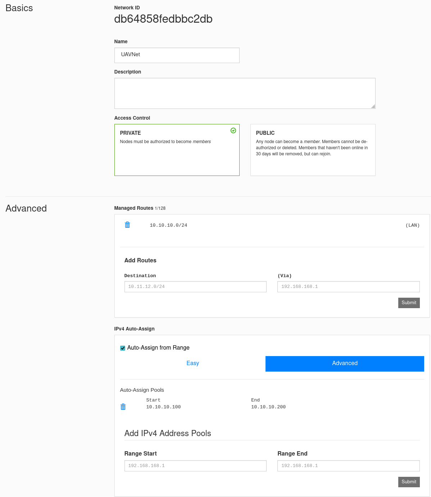
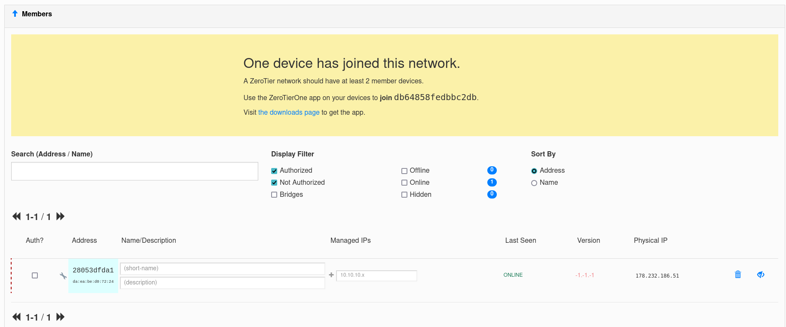
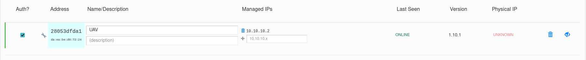
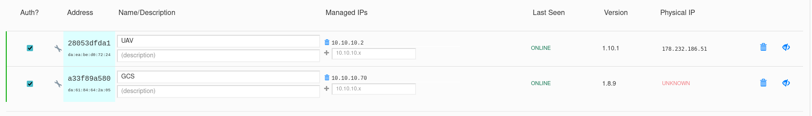

# Configure Zerotier

So the goal of this configuration is to build a new Zerotier Network, and join the UAV and handcontroller to the network. In the process we need to follow a convention for IP addresses for both UAV and handcontroller, to ensure connectivity. Should you decide to deviate from the recommended addresses, you will have to change configurations for MAVLink Router, and Video Streamer. Having said that, it is possible to have more than one UAV in the same network, and control severeal UAVs from the same handcontroller.

## Steps to build network

- 1. Go to [my.zerotier.com](https://my.zerotier.com/) to log in or sign up for an account. The setup here suggest that this is the only network and only one UAV in the network.

- 2. Click `Create A Network` and click into the network.

- 3. Expand the `Settings` region, and give the network a name you can recognize (only important fot this portal, not used outside for anything). Something like UAVNet. Make sure the `Access Control` is set to Private.

- 4. Scroll down to `Advanced`. Remove the current managed route, and add a new one for `10.10.10.0/24`. Under `IPv4 Auto-Assign` choose `Advanced`, remove the current range, and add a new Range `10.10.0.100 - 10.10.0.200`.

- 5. Save the Network ID. Should be a 16 character long unique ID for your network. You will need this ID to join both the UAV and the handcontroller next

When done, the settings should look like the picture below.

## Steps to join UAV

- 1. Make sure you have noted the Network ID from the building of the network.

- 2. Log in to the UAV and type `sudo zerotier-cli join XXXXX` Where XXXXX is the Network ID from above. The response should be `200 join OK`.

- 3. Go back to your network in [my.zerotier.com](https://my.zerotier.com/). Collapse all regions, and expand the `Members` region. You should now have a line looking something like ther picture below. Note the dotted vertical line, which indicates this is a new request from a node to join the network:

- 4. The next step is to approve the node. Tick the box under `Auth?`, and a few moments later the vertical line should turn solid and green

- 5. Now we need to assign a specific IP for this new node, which will be the same as the UAV. We will stick to the convention of giving the UAV the address of `10.10.10.2`. Under `Managed IPs` type inn the address, and click the plus sign. Also remove the auto assigned adress.

- 6. Give the node a short name, like UAV

- 7. Reboot the Raspberry Pi.

The page should now show like this:

## Steps to join handcontroller

- 1. Make sure you have noted the Network ID from the building of the network.

- 2. Make sure the phone is an Android device, as QGroundcontrol is very outdated on iOS. Search for and install the app called `ZeroTier One` in the `Play Store`. And then start the app.

- 3. Tap the wrench to get to settings, and make sure that `Use Cellular Data` is checked. Go back.

- 4. Click the plus sign to add a new network, and type in the Network ID from above, and click the button `Add Network` at the button (you might have to hide the keyboard).

- 5. Still on the phone, tap the slider next to you new network, and approve that Zerotier tries to set up a new VPN.

- 6. Now move to the portal, and you should see a new node showing up, with a dotted red vertical line next to itself.

- 7. Give the node a name (like GCS - Ground Control Station), check the `Auth?` box, and set a fixed IP to `10.10.10.70`.

When done the portal should look something like this:

## Verify

Go to the UAV console and type `ip a`. A network starting with the letter `z` should be listed, with the address `10.10.10.2`. Next type `ping 10.10.10.70` to verify you can connect from UAV to the handcontroller. The response should give you how long time the ping took (Ctrl+C to stop).