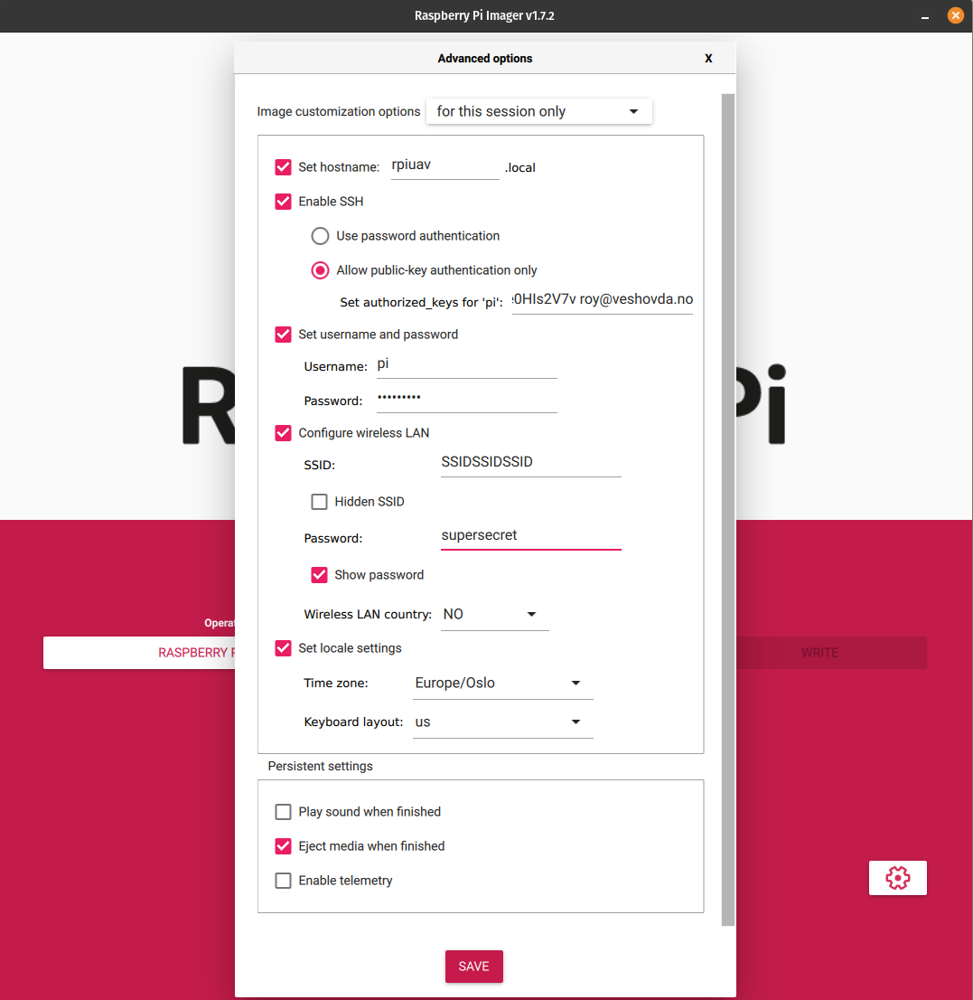

# Install Operating System
Currently we will be using the original [Raspberry Pi OS (64 bits version)](https://www.raspberrypi.com/software/). In the future we might switch to [DietPi](https://dietpi.com/), for a simpler installation process.

You will need to have an SD card reader, and a possibility to connect to the Raspberry Pi, and finally a way for the Raspberry Pi to connect to the internet (USB 4G dongle is OK). As for connecting to the RPi you can use a monitor plus keyboard, of connect to the RPi using SSH.

The steps are:
- 1. Download and install Raspberry Pi Imager for your computer (different instructions based on you OS). [General instructions can be found here.](https://www.raspberrypi.com/software/) If you are experienced in this field, it is of course OK to download image directly, and use Balena Etcher or Rufus to flash the SD card. The simplest solution is, however, to use [Raspberry Pi Imager](https://www.raspberrypi.com/software/), which is what the following instructions will be based on.

- 2. With an SD card reader plugged into you computer, insert the SD card.

- 3. Start Imager, and choose OS, and select `Raspberry Pi OS (other)` and then `Raspberry Pi OS Lite (64-bit)`. Select the SD card you inserted under the button `Choose Storage`.

- 4. Click on the Gear icon down to the right, and fill out the fields as shown in the image below. For added security you should always default to using SSH-keys. If this is impossible to you, or you prefer a password approach, then select `Use password authentication` instead. Set the username and password for you. And also set the WiFi details, if you are planning to connect to Wifi.

- 5. Press `WRITE`, and then confirm (and you password, if needed). Wait for the flashing to complete.

- 6. You can close down Raspberry Pi Imager now, and eject the SD card from you computer.

- 7. Insert SD card into the Raspberry Pi and power on. Also connect to the RPi using SSH or keyboard/monitor.

- 8. For the next operation you will need Internet connectivity for the RPi, to install the remaining part. This can either be the 4G USB dongle, or through WiFi, whichever is easiest for you. We will download up to 3GB, so make sure you have a good dataplan if using 4G. DO NOT use the wired Ethernet, as we will set a static IP for the interface to connect to the Pixhawk.

- 9. Connected and logged in to the Raspberry Pi, you need to run the following command (This will install K3S and Zerotier, and also set a few settings for the OS.): `curl -s https://gitlab.com/got.vision/rpiuav/-/raw/main/install.sh | sh -`

- 10. Depending on you internet speed, this will take a few minutes to complete

- 11. Reboot by typing `sudo reboot`